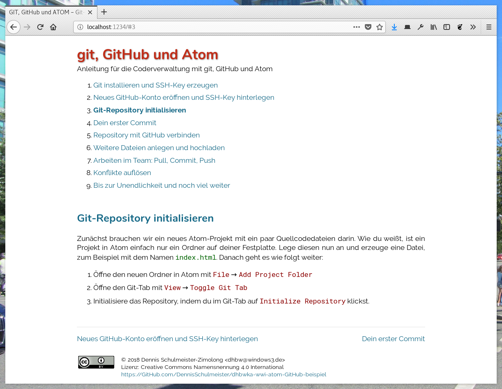
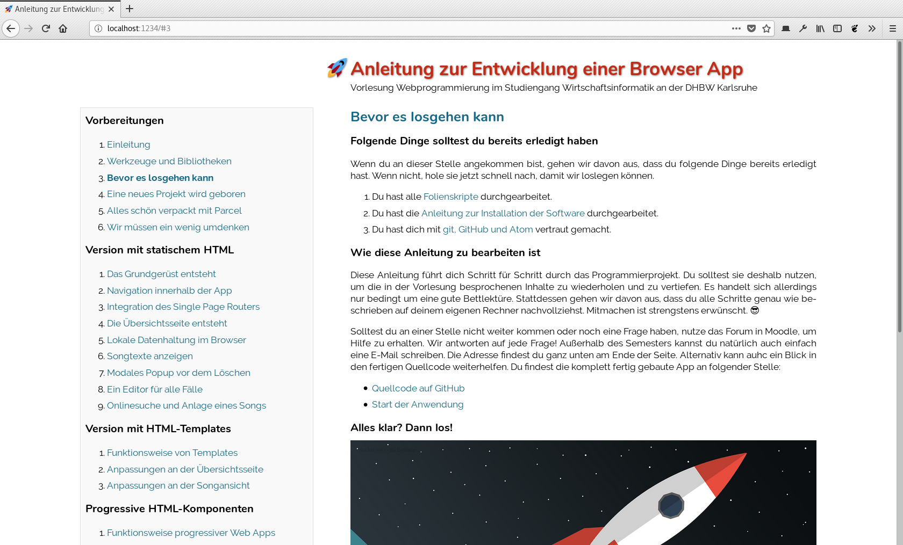

mini-tutorial.js - Beautiful HTML tutorials with minimal effort
===============================================================

Documentation
-------------

 * See mini-tutorial.js in action: [Manual](https://www.wpvs.de/mini-tutorial/)
 * Download the [manual source code](https://www.github.com/DennisSchulmeister/mt-manual)

Templates to get started:

 * [Simple template](https://www.github.com/DennisSchulmeister/mt-template-simple)
 * [Book template](https://www.github.com/DennisSchulmeister/mt-template-book)
 * [Roundbox template](https://www.github.com/DennisSchulmeister/mt-template-roundbox)

What is it
----------

Oh, nothing special but thanks for asking. Basically it is just a tiny hack to
solve a problem of mine. For my lectures I wanted to be able to put tutorials
online without much effort. Tiny manuals or documentation pages with a clean
and beautiful look and a possibility to browse between chapters. This is,
instead of simply showing a long HTML page, it should be possible to only show
one chapter at a time and read through them like a book.

So here it is. The result of one evening of coding. A minimal single page
app which allows to easily build beautiful HTML tutorials. No feature bloat
and no external dependencies. Just one VanillaJS class and some stylesheets.
And it doesn't get in your way, except for the stylesheets which applies global
styling to your document.

White Theme
-----------

Everybody loves screenshots, right? Well I do, so feel right at home. This
is the `white.css` theme:

See: https://www.github.com/DennisSchulmeister/mt-template-simple

Book Layout
-----------

Extension to `white.css` called `book.css` for large documents with a book-like
structure:

See: https://www.github.com/DennisSchulmeister/mt-template-book

Roundbox Layout
---------------

Alternative to `white.css` called `roundbox.css` for a more playful design:

See: https://www.github.com/DennisSchulmeister/mt-template-roundbox

Copyright
---------

mini-tutorial.js (https://www.github.com/DennisSchulmeister/mini-tutorial.js)  
© 2018 Dennis Schulmeister-Zimolong <dennis@pingu-mail.de>

This program is free software: you can redistribute it and/or modify
it under the terms of the GNU Affero General Public License as
published by the Free Software Foundation, either version 3 of the
License, or (at your option) any later version.
