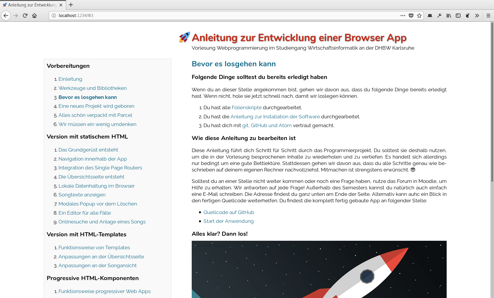
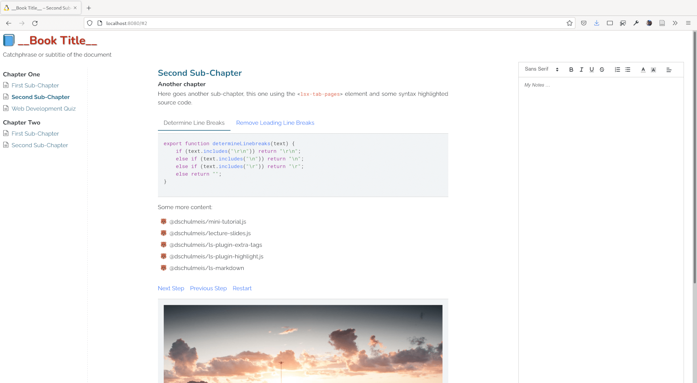
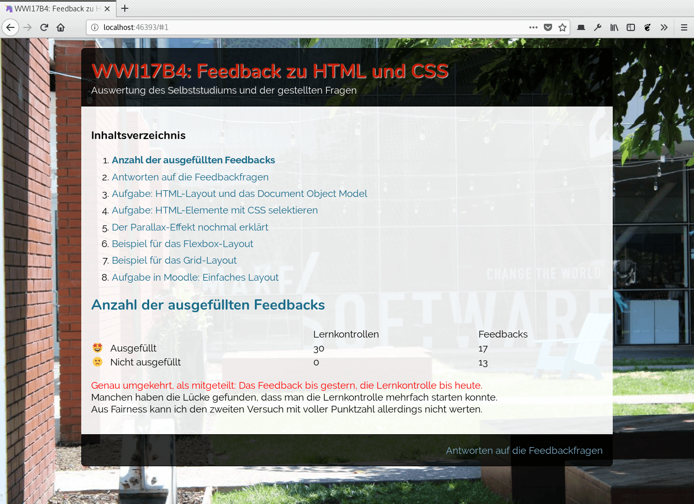
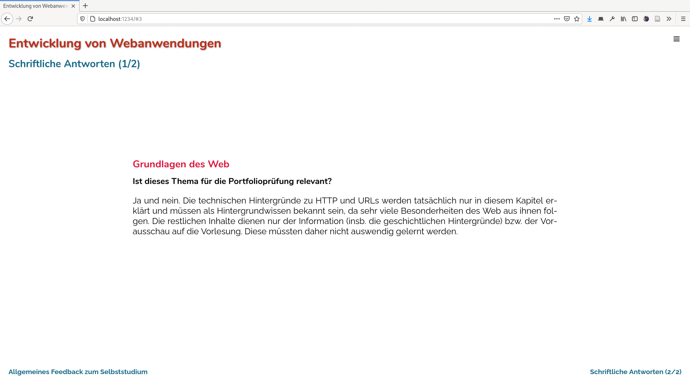

mini-tutorial.js - Beautiful HTML tutorials with minimal effort
===============================================================

Documentation
-------------

 * See mini-tutorial.js in action: [Manual](https://www.wpvs.de/repo/mini-tutorial/manual/#1)
 * Real-world example of the book template: [Unfinished web development book](https://www.wpvs.de/repo/webprog/browser-app/#1)
 * Download the [manual source code](https://www.github.com/DennisSchulmeister/mt-manual)

Templates to get started:

 * [Simple template](https://www.github.com/DennisSchulmeister/mt-template-simple)
 * [Book template](https://www.github.com/DennisSchulmeister/mt-template-book)
 * [Studybook template](https://www.github.com/DennisSchulmeister/mt-template-studybook)
 * [Roundbox template](https://www.github.com/DennisSchulmeister/mt-template-roundbox)
 * [Slideshow template](https://www.github.com/DennisSchulmeister/mt-template-slideshow)

Optional plugins:

 * [Markdown Syntax](https://www.github.com/DennisSchulmeister/ls-plugin-markdown)
 * [Syntax Highlighting](https://www.github.com/DennisSchulmeister/ls-plugin-highlight.js)
 * [LS Extra Tags](https://www.github.com/DennisSchulmeister/ls-plugin-extra-tags)

What is it
----------

This is the little brother of [lecture-slides.js](https://www.github.com/DennisSchulmeister/lecture-slides.js)
to create simple HTML manuals and presentations without much effort, solving
a problem of mine:  For my lectures I wanted to be able to put tutorials
online without much effort. Tiny manuals or documentation pages with a clean
and beautiful look and a possibility to browse between chapters. This is,
instead of simply showing a long HTML page, it should be possible to only show
one chapter at a time and read through them like a book.

This package is intentionaly kept simple. Though some compatibility with
`lecture-slides.js` is maintained, it is lacking heavy features like a
full-blown UI or print/export optimized rendering. The main purpose is to read
the content on screen, which can be done with one simple VanilaJS class and
(almost) no dependencies. Only two dependencies are added to `@dschulmeis/ls-utils`
for common utilities shared with `lecture-slides.js`, and `hammer.js` for optional
touch navigation.

Using the built-in themes different types of documents like short manuals, books
or simple slideshows can be rendered. The same plugins as for `lecture-slides.js`
can be used to extend the HTML syntax.

Optional dependencies
---------------------

Documents built with `mini-tutorial.js` should use a bundler like webpack or
eslint to pull in the source code of this package. Optionaly, any of the existing
plugins for `lecture-slides.js`, which provide some often-needed custom HTML
elements, can be used, too. If Bootstrap is used (e.g. in order to use the
custom elements from `@dschulmeis/ls-plugin-extra-tags`), LESS can be used to
load the file `themes/bootstrap.less` with same additional styling.

White Theme
-----------

This is the `white.css` theme with probably the most simple layout:

See: https://www.github.com/DennisSchulmeister/mt-template-simple

Book Layout
-----------

Extension to `white.css` called `book.css` for large documents with a book-like
structure:

See: https://www.github.com/DennisSchulmeister/mt-template-book

Studybook Layout
----------------

Similar extension to `white.css` as `book.css` but with a more professional
layout and the possibility to make notes to each section.

See: https://www.github.com/DennisSchulmeister/mt-template-studybook

Roundbox Layout
---------------

Alternative to `white.css` called `roundbox.css` for a more playful design:

See: https://www.github.com/DennisSchulmeister/mt-template-roundbox

Slideshow Layout
----------------

Alternative to the other css files for a simple slideshow presentation:

See: https://www.github.com/DennisSchulmeister/mt-template-slideshow

Copyright
---------

mini-tutorial.js (https://www.github.com/DennisSchulmeister/mini-tutorial.js)  
© 2018 – 2022 Dennis Schulmeister-Zimolong <dennis@pingu-mail.de>

This program is free software: you can redistribute it and/or modify
it under the terms of the GNU Affero General Public License as
published by the Free Software Foundation, either version 3 of the
License, or (at your option) any later version.
